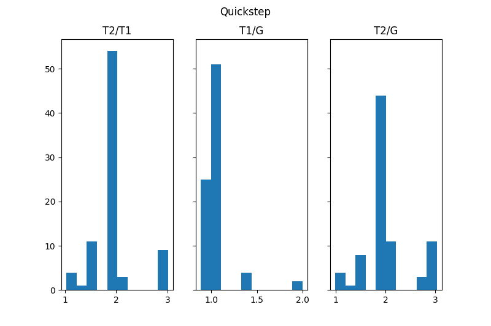

# Homework 2 for Music Information Retrieval

## Environment

* ubuntu 16.04 LTS
* python3.5.2 (using Pycharm 2018.1.4)
* extra modules: numpy, scipy, matplotlib, prettytable, librosa

## Dataset

All the experiments were done on [Ballroom dataset](http://mtg.upf.edu/ismir2004/contest/tempoContest/node5.html), 
consist of 30s long ballroom dancing music pieces.

> How to use ?

1. Download the [raw audio files](http://www.iua.upf.edu/mtg/ismir2004/contest/tempoContest/data1.tar.gz).
2. Download the [tempo annotations](http://www.iua.upf.edu/mtg/ismir2004/contest/tempoContest/data2.tar.gz) of each pieces.
3. Donwload the [beat annotations](https://github.com/CPJKU/BallroomAnnotations).
4. Modified the directory variables in [utils.py](utils.py) to where you unzip the data.
    
    ```
    data_dir = '/where/you/put/audio/files'
    bpm_label_dir = '/where/you/put/bpm/annotations'
    beat_label_dir = /where/you/put/beat/annotations'
    ```
    
## Usage of each file

### Q1~3: Tempo estimation using Fourier tempogram

In this task, we use Fourier tempogram, which is the short-time Fourier transform of the [spetral flux](https://en.wikipedia.org/wiki/Spectral_flux) novelty curve of the music, 
to perform tempo estimation.

    $ python3 Q1-3.py

The program will output its P-score and ALOTC score (at least one tempo correct) on eight different genres.


    +---------------+---------+--------+--------------+--------------+--------------+
    |     Genre     | P-score | ALOTC  | 1/2T P-score | 1/3T P-score | 1/4T P-score |
    +---------------+---------+--------+--------------+--------------+--------------+
    |   ChaChaCha   |  0.3285 | 0.7387 |    0.4968    |    0.0085    |    0.1571    |
    |      Jive     |  0.4543 | 0.8333 |    0.1583    |    0.0437    |    0.0131    |
    |   Quickstep   |  0.4785 | 0.9146 |    0.0085    |    0.0000    |    0.0000    |
    |     Rumba     |  0.2185 | 0.4898 |    0.5141    |    0.0083    |    0.2032    |
    |     Samba     |  0.1332 | 0.2907 |    0.4468    |    0.0000    |    0.3912    |
    |     Tango     |  0.4958 | 0.9535 |    0.3841    |    0.0000    |    0.0000    |
    | VienneseWaltz |  0.5323 | 0.9692 |    0.0854    |    0.0000    |    0.0000    |
    |     Waltz     |  0.4057 | 0.8000 |    0.3560    |    0.0283    |    0.0448    |
    +---------------+---------+--------+--------------+--------------+--------------+

### Q4~5: Tempo estimation using autocorrelation tempogram

In this task, we use [autocorrelation](https://en.wikipedia.org/wiki/Autocorrelation) tempogram to perform tempo estimation.

    $ python3 Q4-5.py

    +---------------+---------+--------+--------------+--------------+--------------+------------+------------+------------+
    |     Genre     | P-score | ALOTC  | 1/2T P-score | 1/3T P-score | 1/4T P-score | 2T P-score | 3T P-score | 4T P-score |
    +---------------+---------+--------+--------------+--------------+--------------+------------+------------+------------+
    |   ChaChaCha   |  0.5064 | 0.9820 |    0.3512    |    0.0000    |    0.0000    |   0.1333   |   0.0000   |   0.0000   |
    |      Jive     |  0.4544 | 0.9333 |    0.0000    |    0.0077    |    0.0000    |   0.5022   |   0.0000   |   0.0204   |
    |   Quickstep   |  0.4331 | 0.8780 |    0.0000    |    0.0000    |    0.0000    |   0.4717   |   0.0114   |   0.0241   |
    |     Rumba     |  0.4533 | 0.9184 |    0.4554    |    0.0000    |    0.0048    |   0.0099   |   0.0000   |   0.0000   |
    |     Samba     |  0.3885 | 0.7674 |    0.4262    |    0.0000    |    0.0400    |   0.0210   |   0.0000   |   0.0000   |
    |     Tango     |  0.5144 | 0.9535 |    0.2381    |    0.0000    |    0.0000    |   0.2021   |   0.0000   |   0.0000   |
    | VienneseWaltz |  0.5071 | 0.9077 |    0.0445    |    0.0000    |    0.0000    |   0.2104   |   0.1377   |   0.0000   |
    |     Waltz     |  0.2908 | 0.5364 |    0.3277    |    0.0313    |    0.0609    |   0.0000   |   0.0037   |   0.0000   |
    +---------------+---------+--------+--------------+--------------+--------------+------------+------------+------------+
    
    
### Q6: Tempo estimation by combine frequency and periodicity

This task the teacher ask us to find de wae to improve and outperform the above method.

> How to improve?

Histogram of the most two probable tempo using Fourier tempogram:


Histogram of the most two probable tempo using autocorrelation tempogram:


As you can see, Fourier tempogram is easily to produce tempo which is multiple of the true tempo; 
on the other hand, autocorrelation tempogram is easily to produce tempo which is one half of the true tempo. 
So I decide to combine the two tempograms together, let each one supress others unwanted value and reserved the most probable one.

> How to do?

And intuitive way to do it is mapping tempograms to the same domain, then multiply together.
The implementation detailed is similar to this [paper](https://dl.acm.org/citation.cfm?id=2824149).

    $ python3 Q6.py
    
    +---------------+---------+--------+
    |     Genre     | P-score | ALOTC  |
    +---------------+---------+--------+
    |   ChaChaCha   |  0.4962 | 0.9910 |
    |      Jive     |  0.5229 | 0.9667 |
    |   Quickstep   |  0.3957 | 0.8293 |
    |     Rumba     |  0.4061 | 0.8776 |
    |     Samba     |  0.3617 | 0.7326 |
    |     Tango     |  0.6069 | 0.9884 |
    | VienneseWaltz |  0.4444 | 0.8000 |
    |     Waltz     |  0.4546 | 0.8091 |
    +---------------+---------+--------+
    
The result shows that some genres have been improved, but some are not.

### Q7: Beat tracking using dynamic programming

In this task, we also use the same dataset to perform beat tracking. The algorithm we used is describe [here](https://www.ee.columbia.edu/~dpwe/pubs/Ellis07-beattrack.pdf). 
I used CFP method to compute the tempo that can be used by the algorithm.

The program will output the precision, recall and f-score evaluate with tolerance of +-70 ms on each genre. 

    $ python3 Q7.py
    
    +---------------+-----------+--------+----------+
    |     Genre     | Precision | Recall | F-scores |
    +---------------+-----------+--------+----------+
    |   ChaChaCha   |   0.6381  | 0.9792 |  0.7727  |
    |      Jive     |   0.9386  | 0.8072 |  0.8680  |
    |   Quickstep   |   0.9262  | 0.6444 |  0.7600  |
    |     Rumba     |   0.5558  | 0.9378 |  0.6979  |
    |     Samba     |   0.4332  | 0.8356 |  0.5706  |
    |     Tango     |   0.8807  | 0.9154 |  0.8977  |
    | VienneseWaltz |   0.9132  | 0.6732 |  0.7750  |
    |     Waltz     |   0.5526  | 0.8018 |  0.6543  |
    +---------------+-----------+--------+----------+
    
    
### Down beat tracking

This is a bonus question, and I just do some trial and error to see what will happen. I used the beats in Q7 to construct 
a bidirectional spectral flux novelty curve in beat level, and use the same algorithm in Q7 to find the path of downbeat 
with fix period of 4 samples (which means I assume the beats are isometric and have time signature of 4/4).

The result is apparently not good, but it's fun to try using traditional technique instead of fancy machine learning method.

    $ python3 downbeat.py
    
    +---------------+-----------+--------+----------+
    |     Genre     | Precision | Recall | F-scores |
    +---------------+-----------+--------+----------+
    |   ChaChaCha   |   0.1204  | 0.1680 |  0.1403  |
    |      Jive     |   0.0878  | 0.0679 |  0.0765  |
    |   Quickstep   |   0.0823  | 0.0515 |  0.0634  |
    |     Rumba     |   0.0673  | 0.1037 |  0.0816  |
    |     Samba     |   0.1794  | 0.3167 |  0.2291  |
    |     Tango     |   0.5912  | 0.5463 |  0.5679  |
    | VienneseWaltz |   0.3285  | 0.1639 |  0.2187  |
    |     Waltz     |   0.2155  | 0.2076 |  0.2114  |
    +---------------+-----------+--------+----------+